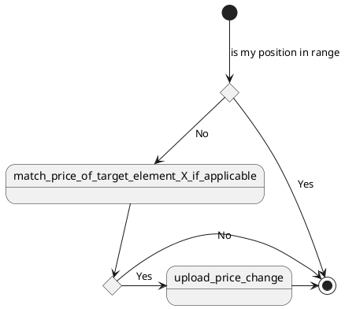

<!-- TOC -->

- [1. cm-boy](#1-cm-boy)
- [2. Introduction](#2-introduction)
- [3. Technologies](#3-technologies)
- [Setup](#setup)
    - [API Access](#api-access)
- [4. Features of CmBoy](#4-features-of-cmboy)
- [5. How to use CmBoy](#5-how-to-use-cmboy)
- [6. The Algorithm](#6-the-algorithm)
    - [6.1. Approach and reasoning](#61-approach-and-reasoning)
    - [6.2. How this algorithm works](#62-how-this-algorithm-works)
- [7. Disclaimer](#7-disclaimer)

<!-- /TOC -->

# 1. cm-boy
This boy handles all the cardmarket stuff! Good boy! :)

# 2. Introduction

This little boy will adjust the prices of your card stock at cardmarket.eu in an automated fashion. It will try to follow the market at the market level you prefer. Therefore it will try to keep your offered cards in a certain range within the offered cards by other users, but not undercut a certain minimal price you specify for certain categories.
 
For example: I can specify, that I want my cards to be listed at the 10th place of the list of comparable offers, but I am fine with a range of 5 to 15. More on the algorithm and ways to adjust it later on.

# 3. Technologies
 
The CmBoy is written in python (using v3.8, but compatible versions should be fine) and outside of the libraries included in a standard python installation only uses the libraries stated in the requirements.txt:

* requests-oauthlib v1.3.0
* dicttoxml v1.7.4
 
You should install them using pip3.

# Setup

## API Access

* You must set up your account to have API access
* Go to https://www.cardmarket.com/en/Magic/Account/API and register your account for a dedicated app.
* Copy the information to a file called confidential_config.json in the folder data, follow the template given below

```json
{
  "account": {
    "user_name": "YourNameHere",
    "sellCount": 0
  },
  "cm_access": {
    "app_name": "cm_bot",
    "app_type": "Dedicated",
    "app_token": "0123456789ABCDEF",
    "app_secret": "0123456789ABCDEF0123456789ABCDEF",
    "access_token": "0123456789ABCDEF0123456789ABCDEF",
    "access_secret": "0123456789ABCDEF0123456789ABCDEF"
  }
}
```

# 4. Features of CmBoy

It can currently do the following:

* Get the stock of the specified user
* Apply the algorithm explained in this document
* Upload the adjusted prices, unless specified at program call with the dry run option

It was not tested to do the following:

* Handle products other than Magic: the Gathering single cards. So it was not tested to adjust prices for other games or products such as sealed products or accessories.

# 5. How to use CmBoy

After you set up the python environment you can call it from the command line with ```py CmBoy.py```. You can modify the behavior with optional arguments, for a full list type in ```py CmBoy.py  --help```. Currently the following options are implemented:

* ```--dryrun``` Give this optional argument to NOT upload the cards. This can be useful if you first want to try out the program
* ```--quiet``` Give this optional argument to disable all output to the command line. This could be useful if you want to use the CmBoy within another script and command line output interferes with that program

# 6. The Algorithm

Currently there is just one algorithm available and it's fairly basic, but has been found to work well.

## 6.1. Approach and reasoning

The market for cards is always changing, cards go up and down and you don't want to miss an upwards trend, but also don't want to have your cards rot at a too high price point. So this algorithm will follow the market. Cardmarket.eu provides an average and trend prices, but those sometimes tend to be not good (at least for me and my experience).

So this algorithm allows you to place your offer within a certain region of the sorted listing for a specific card.

## 6.2. How this algorithm works

This Flow chart shows how it works:



If you prefer words and some info left from above graph:

0. Get card stock of user and do the algo for each card in stock
1. Check if the current card is already in range. Yes? Done No? Continue.
1. Filter listing to narrow down more comparable offers
1. Try to match price with the card currently at target position.
    1. Handle cornercases of too short listings
    1. If the price would be below the minimal price specified, use the minimal price instead
    1. Note if card price actually changed
1. If card price was adjusted, upload (this is not done if ```--dryrun is specified```)

# 7. Disclaimer

This program is published under the specified license and "as is" in the hope it is useful for others. The following can't be claimed:

* Product support.
* Correct execution of the software.
* Financial responsibility for prices set with this software.
* Any damage this software caused.

Use at own risk and responsibility.