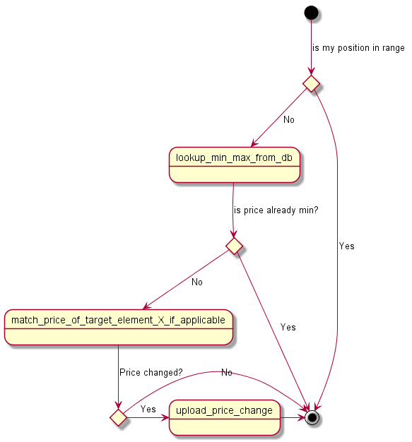

[](https://circleci.com/gh/SoftPofi/cm-boy)

<!-- TOC -->

- [1. cm-boy](#1-cm-boy)
- [2. Introduction](#2-introduction)
- [3. Technologies](#3-technologies)
- [4. Setup](#4-setup)
    - [4.1. API Access](#41-api-access)
    - [4.2. Modify the algorithm](#42-modify-the-algorithm)
- [5. Features of CmBoy](#5-features-of-cmboy)
- [6. How to use CmBoy](#6-how-to-use-cmboy)
- [7. The Algorithm](#7-the-algorithm)
    - [7.1. Approach and reasoning](#71-approach-and-reasoning)
    - [7.2. How this algorithm works](#72-how-this-algorithm-works)
    - [7.3. Ignore specific listing](#73-ignore-specific-listing)
- [8. Disclaimer](#8-disclaimer)

<!-- /TOC -->

# 1. cm-boy
This boy handles all the cardmarket stuff! Good boy! :)

# 2. Introduction

This little boy will adjust the prices of your card stock at cardmarket.eu in an automated fashion. It will try to follow the market at the market level you prefer. Therefore it will try to keep your offered cards in a certain range within the offered listing of cards, but not undercut a certain minimal price you specify for certain categories.
 
For example: I can specify, that I want my cards to be listed at the 10th place of the list of comparable offers, but I am fine with a range of 5 to 15. More on the algorithm and ways to adjust it later on.

# 3. Technologies
 
The CmBoy is written in python (using v3.8, but compatible versions should be fine) and outside of the libraries included in a standard python installation it only uses the libraries stated in the requirements.txt:

* requests-oauthlib v1.3.0
* dicttoxml v1.7.4
 
You should install them using pip3.

# 4. Setup

## 4.1. API Access

* You must set up your account to have API access.
* Go to https://www.cardmarket.com/en/Magic/Account/API and register your account for a dedicated app.
* You must set the confidential information as environment variables on your host. On Windows this can be done using the [SETX](https://docs.microsoft.com/de-de/windows-server/administration/windows-commands/setx), on Linux [add them to the approprate file](https://unix.stackexchange.com/a/117470). Set the variables as follows:
  * ```cm_user_name```
  * ```cm_app_name``` (optional)
  * ```cm_app_type``` (optional)
  * ```cm_app_token```
  * ```cm_app_secret```
  * ```cm_access_token```
  * ```cm_access_secret```


## 4.2. Modify the algorithm

All data that determine the algorithm and CmBoys behavior is specified in the ```config.json``` in the folder ```data```.
The section ```"urls"``` should only be changed if the API address ever changes.
The section ```"product_default_params"``` can be modified as written in comments ```//``` after each line. Remove those comment lines in your final .json file, since those comments are illegal in json files.

```
"product_default_params": {
    "start": 0,         // Increase this to get rid of the very lowest offers.
    "maxResults": 200,  // Increase if you get warnings that you don't have enough data. Max 1000, but the bigger the slower the algorithm.
    "minUserScore": 1   // Change this if you also want to consider users that have a low score
  }
```
The section ```listing_static_filter``` filters the received listings. So far in this section there is nothing to adjust, since this is done by the CmBoy.

```
"listing_static_filter": {
    "seller_country": "D"   // This is automatically set no need to change anything
  }
```
The section ```algo_parameter``` changes the behavior of the algorithm.

```
"algo_parameter":
  {
    "Mythic": {             // This is the entry for mythic rare cards. The others have the same entries and work the same
      "min_price":          // Specify the minimal prices for cards of that category
      {
        "normal": 0.19,     // Min Price for Non-Foil, Non-Playset cards
        "playset": 0.98,    // Min Price for Playset Cards
        "foil": 0.34        // Min Price for Foil cards (Foil playsets not supported, this price is taken instead)
      },
      "position":           // Specify the position you want to place your cards
      {
        "target": 5,        // The optimal position your card should be at
        "min": 3,           // The lowest position your card is accepted
        "max": 7            // The highest position your card is accepted. Don't make this gap too narrow, sometimes the perfect position can't be reached.
      },
      "position_foil":      // same as position, but you may have different preferences for foil cards.
      {
        "target": 2,
        "min": 2,
        "max": 4
      }
    },
```
# 5. Features of CmBoy

It can currently do the following:

* Get the stock of the specified user
* Apply the algorithm explained in this document
* Upload the adjusted prices, unless specified at program call with the dry run option
* Ignore listings that have the designated pattern in their comments (see later)

It currently can **not** do the following:
* Adjust prices for things that are not Magic: the Gathering single cards. So for example accessories, sealed product or listings in the "lots" section are not supported. Please mark those with the ignore pattern in the listing's comment.

It was **not** tested to do the following:

* Handle other games than Magic: the Gathering, so it was not tested to adjust prices for other games (Yugioh, ...).

# 6. How to use CmBoy

It is assumed, that you are using the command line interface and python is callable with ```py``` (default in Windows and newer python versions, in Linux use ```python3``` instead or set an alias with ```alias py=python3```):  
After you set up the python environment you can call it from the command line with ```py CmBoy.py```. You can modify the behavior with optional arguments, for a full list type in ```py CmBoy.py  --help```. Currently the following options are implemented:

* ```--dryrun``` or ```-d``` Give this optional argument to NOT update the cards. This can be useful if you first want to try out the program
* ```--quiet``` or ```-q``` Give this optional argument to disable all output to the command line. This could be useful if you want to use the CmBoy within another script and command line output interferes with that program
* ```--forcePriceSet``` or ```-f``` Give this optional argument to update prices regardless of current position. This usually results in more price updates per run and jumping of prices in between runs.
* ```--outFile``` or ```-o``` Give this optional argument to save output to a log file. As argument give absolute path to folder where log files are stored. If empty argument but this flag is set, log is stored in CmBoy's folder. It is known that some special characters are in the log. They are special characters that change the color of characters on the command line.

# 7. The Algorithm

Currently there is just one algorithm available and it's fairly basic, but has been found to work well.

## 7.1. Approach and reasoning

The market for cards is always changing, cards go up and down and you don't want to miss an upwards trend, but also don't want to have your cards rot at a too high price point. So this algorithm will follow the market. Cardmarket.eu provides an average and trend prices, but those sometimes tend to be not good (at least for me and my experience).

So this algorithm allows you to place your offer within a certain region of the sorted listing for a specific card.

## 7.2. How this algorithm works

This Flow chart shows how it works:



If you prefer words and some info left from above graph:

0. Get card stock of user and do the algo for each card in stock
1. Check if the current card is already in range. Yes? Done. No? Continue.
1. Get card price of card in target position (so e.g. price of card on position 10)
1. Is target price lower or equal to minimum price for card? 
    a) Yes: Is my card already at minimum price? If so done, if not, set it to min price for that category.
    b) No: So the card is above min price for that category. Has your card the same position as target card (this could be if a lot of listings have the same price and a better selling score than you). If that's the case, there is nothing you can do (except for undercut everyone, which usually is not worth it). In the other case, your card is matched to the market price.

If the card price was adjusted, the card is added to the list of cards that will be uploaded (this is not done if ```--dryrun``` is specified).

## 7.3. Ignore specific listing

To ignore a specific listing add ```|#00``` anywhere in the listing's comment. It doesn't matter if it's in the beginning or the end or somewhere in the middle of the sentence of the comment. So for example a comment that makes the listing be ignored by cm-boy is: ```Card has a little scratch, see picture. |#00```

This is useful if:
* You have a listing not supported by cm-boy, so for example accessories, sealed product or anything but Magic: The Gathering single cards.
* You don't want a certain card to be price adjusted by the cm-boy


# 8. Disclaimer

This program is published under the specified license and "as is" in the hope it is useful for others. The following can't be claimed:

* Product support.
* Correct execution of the software.
* Financial responsibility for prices set with this software.
* Any damage this software caused.

Use at own risk and responsibility.